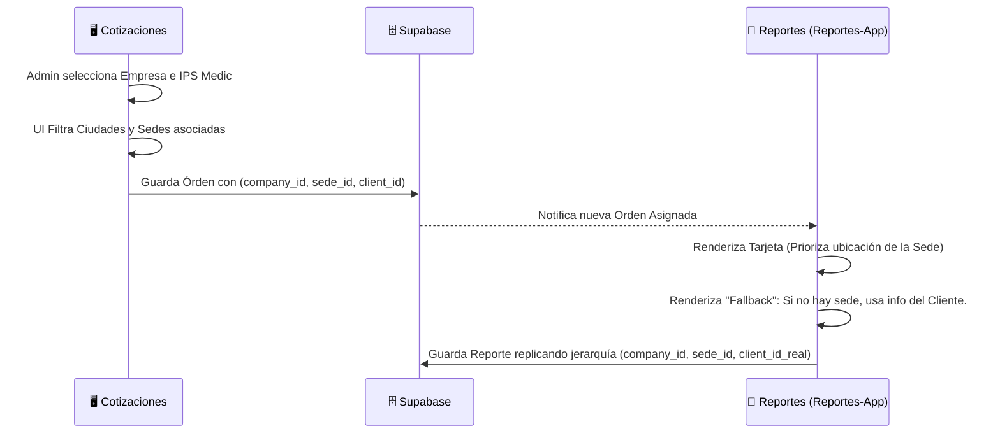

# 🏢 Documentación de Arquitectura: Sincronización Cotizaciones y Reportes MACRIS

Esta documentación detalla los recientes cambios estructurales, actualizaciones de base de datos y la orquestación de la nueva sincronización de **Empresas, Sedes y Clientes** entre la plataforma de **Cotizaciones (V31)** y **Reportes (V16)**.

---

## 1. Nuevo Modelo de Entidades (Residencial vs Empresa)

Se re-estructuró la forma en la que el sistema maneja a los clientes para soportar operaciones de gran escala manteniendo la simplicidad para los servicios del día a día.

- **Cliente Residencial:** Diseño simplificado que solo requiere `Nombre`, `Dirección` y `Ciudad`. Permite crear órdenes y reportes de manera ágil y directa.
- **Cliente Empresarial (Empresa):** Arquitectura jerárquica robusta pensada para corporaciones con múltiples localizaciones. 
  La nueva jerarquía estricta (en cascada) funciona así:
  1. **Empresa (Compañía Madre)**
  2. **👉 Sede (Sucursal de la Empresa en una Ciudad)**
  3. **👉 Dependencia (Área o departamento dentro de la Sede)**

---

## 2. Actualizaciones en Base de Datos (Supabase)

Para dar soporte a la sincronización bidireccional, se actualizaron y robustecieron varias tablas maestras y de transacciones:

| Entidad / Tabla | Modificación | Propósito |
| :--- | :--- | :--- |
| `companies` / `clients` | Unificación conceptual | Las empresas absorbieron un rol centralizado. Se crearon referencias hacia `client_id`. |
| `service_orders` | Nuevas columnas `client_id` y `sede_id` | Permite rastrear y despachar técnicos a ubicaciones físicas precisas basándose en la sede escogida. |
| `maintenance_reports` | Nuevas columnas `client_id` y `sede_id` | Permite adjuntar el snapshot geográfico preciso de dónde se ejecutó la labor (heredado de la Orden). |

---

## 3. Sincronía Perfecta: Cotizaciones ↔ Reportes

El núcleo de los últimos cambios resolvió el desafío de transportar la jerarquía estructural compleja hacia el técnico en el terreno de una forma transparente.



### 3.1. Renderizado de Tarjetas (`ui.ts` - Reportes)
- Las tarjetas de órdenes de servicio asignadas a un técnico ahora evalúan la existencia de una Sede (`sede_id`).
- Si la Orden tiene una configuración tipo Empresa jerárquica, extrae nombre, dirección y contacto de la sede.
- **Fallback Activo:** Si los metadatos de contacto están vacíos o pertenece a un cliente residencial, el sistema intercala los datos heredados desde la base del `clientDetails` asegurando que NUNCA aparezca "N/A" si existe información.

### 3.2. Formulario en Vivo (`openReportFormModal`)
Al hacer clic en "+ Nuevo Reporte" desde una orden:
1. El sistema lee el `sede_id` de la Orden originada en Cotizaciones.
2. Auto-completa (pre-selecciona) la **Empresa**.
3. Restringe las **Ciudades** usando la herencia de la Sede.
4. Auto-completa la **Sede** y expone sus **Dependencias** al instante.

---

## 4. Ingeniería de Resiliencia: "Repetir datos de cliente"

Se hallaba un error formativo donde el sistema inyectaba la ID de la Sede dentro del contenedor de la Empresa durante el salvado (causando corrupción en memoria local al intentar clonar un reporte previo). Resolvimos esto aplicando una estrategia de "Doble Fallback" retro-compatible:

```javascript
// La capa de pre-populación está blindada contra bases de datos sucias:

// Nivel 1: Búsqueda primaria y de Client ID.
let companyIdToSelect = targetEquipment.client_id || targetEquipment.companyId;

// Nivel 2 FALLBACK (Compatibilidad Repetir):
// Si el ID guardado antiguamente está dañado (ej. era de una sede por el bug antiguo)
if (companyIdToSelect && !State.companies.find(c => c.id === companyIdToSelect)) {
    if (targetEquipment.companyName) {
        // Ejecuta búsqueda por nombre (Cadena de texto) para corregir el ID en tiempo real
        const matched = State.companies.find(c => c.name === targetEquipment.companyName);
        if (matched) companyIdToSelect = matched.id;
    }
}
```

### Resultados de la Resiliencia:
Gracias a esta arquitectura, **incluso si un reporte fue guardado con el identificador corrupto en el pasado**, el botón inteligente escanea el "Nombre" de la compañía guardado en el Snapshot del reporte, rescata el `client_id` verdadero desde la base de datos central en caliente, y auto-estructura los cajones selectores.

---

## 5. Otras Mejoras Menores de QoL (Quality of Life)
- **Modal de Detalles (`openViewReportDetailsModal`):** Se insertó explicitamente el campo `Sede` en la lista principal del documento de solo-lectura, entre *Empresa* y *Dependencia*.
- **Gamificación / Notificaciones:** El pop-up verde finalizador del flujo ha sido limpiado y purgado para reflejar profesionalismo ("¡Reporte guardado con éxito!").
